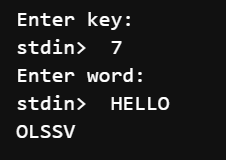
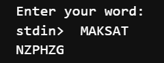

---
## Front matter
lang: ru-RU
title: Лабораторная работа №1
subtitle: "Шифры простой замены"
author:
  - Дурдалыев Максат
teacher:
  - Кулябов Д. С.
  - д.ф.-м.н., профессор
  - профессор кафедры теории вероятностей и кибербезопасности 
institute:
  - Российский университет дружбы народов имени Патриса Лумумбы, Москва, Россия
date: today
date-format: "YYYY-MM-DD" # Example: 2025-09-06

## i18n babel
babel-lang: russian
babel-otherlangs: english
---

## Докладчик

:::::::::::::: {.columns align=center}
::: {.column width="70%"}

  * Дурдалыев Максат
  * Cтудент НФИмд-01-26
  * Российский университет дружбы народов имени Патриса Лумумбы
  * [1032268051@rudn.ru](mailto:1032268051@rudn.ru)
  * <https://github.com/mdurdalyyev>

:::
::: {.column width="30%"}


:::
::::::::::::::

# Цель работы и задачи

**Цель:** изучить и реализовать шифры простой замены.

**Задачи**

Реализовать с помощью языка программирования Julia:

- Шифр Цезаря
- Шифр Атбаш

# Шифр Цезаря

```Julia
function ceaser(word::String, k::Int)
    result = IOBuffer()
    for c in word
        if 'a' <= c <= 'z'
            shifted = (Int(c) - Int('a') + k)%26 + Int('a')
            print(result, Char(shifted))
        elseif 'A' <= c <= 'Z'
            shifted = (Int(c) - Int('A') + k)%26 + Int('A')
            print(result, Char(shifted))
        else
            print(result, c)
        end
    end
    return String(take!(result))
end
```

# Шифр Цезаря

```Julia
print("Enter key: ")
k = parse(Int, readline())
print("Enter word: ")
word = readline()
println(ceaser(word,k))
```

# Шифр Цезаря

{#fig-001 width=70%}

# Шифр Атбаш

```Julia
function atbash(word::String)
    return join(Char(
            if 'a' <= c <= 'z'
                (Int('z') - (Int(c) - Int('a'))) 
            elseif 'A' <= c <= 'Z'
                (Int('Z') - (Int(c) - Int('A')))
            else
                Int(c)
            end
    ) for c in word)
end
print("Enter your word: ")
word = readline()
println(atbash(word))
```

# Шифр Атбаш

{#fig-002 width=70%}

# Выводы

В результате выполнения данной лабораторной работы были изучены и реализованы шифры простой замены (шифр Цезаря и шифр Атбаш).

# Список литературы

1. Julia1.11Documentation. url: https://docs.julialang.org/en/v1/ (дата обр. 11.10.2024)

2. JuliaLang. url: https://julialang.org/ (дата обр. 11.10.2024)