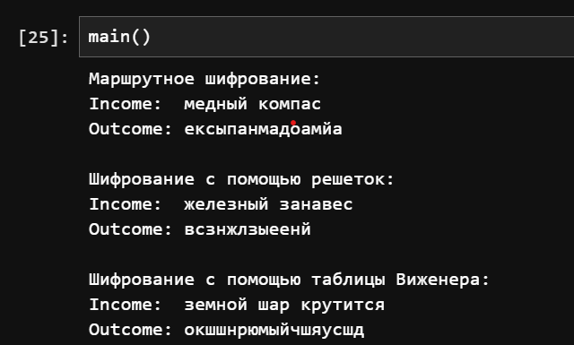

---
## Author
author:
  name: Дурдалыев Максат
  degrees: BSc
  email: 1032268051@rudn.ru
  affiliation:
    - name: Российский университет дружбы народов имени Патриса Лумумбы
      country: Российская Федерация
      postal-code: 117198
      city: Москва
      address: ул. Миклухо-Маклая, д. 6

## Title
title: "Лабораторная работа №2"
subtitle: "Шифры перестановки"
license: "CC BY"
---

# Введение

## Цели и задачи

**Цель работы**

Основная цель работы — изучить и реализовать шифры перестановки.

**Задание**

С помощью языка программирования Julia реализовать:

- маршрутное шифрование,
- шифрование с помощью решеток,
- шифрование с помощью таблицы Виженера.

## Теоретическое введение

Julia — высокоуровневый свободный язык программирования с динамической типизацией, созданный для математических вычислений[@julialang]. Эффективен также и для написания программ общего назначения. Синтаксис языка схож с синтаксисом других математических языков, однако имеет некоторые существенные отличия.
Для выполнения заданий была использована официальная документация Julia[@juliadoc].

# Выполнение лабораторной работы

**Маршрутное шифрование** — метод, при котором символы исходного текста записываются в таблицу (матрицу) построчно, а затем считываются по столбцам в порядке, определяемом алфавитной сортировкой букв пароля.

```julia
function route_code(text, password)
    letters = collect(filter(isletter, lowercase(text)))
    len_p = length(password)
    while length(letters) % len_p != 0
        push!(letters, 'а')
    end
    num_rows = length(letters) ÷ len_p
    table = Matrix{Char}(undef, num_rows, len_p)
    idx = 1
    for i in 1:num_rows
        for j in 1:len_p
            table[i, j] = letters[idx]
            idx += 1
        end
    end
    order = sortperm(collect(password))
    return join([join(table[:, i]) for i in order])
end
```

**Шифрование с помощью решеток (решётки Кардано)** — метод, в котором используется квадратная маска с вырезами. Текст записывается через вырезы, затем маска поворачивается на 90°, и процесс повторяется до полного заполнения квадрата.

```julia
function rotation_90(matrix, k=1)
    for _ in 1:k
        matrix = reverse(matrix, dims=2)
        matrix = permutedims(matrix, (2, 1))
    end
    return matrix
end

function grid_code(text, password)
    letters = collect(filter(isletter, lowercase(text)))
    n = ceil(Int, sqrt(length(letters)))
    n % 2 != 0 && (n += 1)
    while length(letters) < n^2
        push!(letters, 'а')
    end
    k = n ÷ 2
    mask = zeros(Int, n, n)
    mask[1:k, 1:k] .= 1
    matrix = fill(' ', n, n)
    idx = 1
    for rotation in 0:3
        rotated_mask = rotation_90(mask, rotation)
        for i in 1:n, j in 1:n
            if rotated_mask[i, j] == 1
                matrix[i, j] = letters[idx]
                idx += 1
            end
        end
    end
    order = sortperm(collect(password))
    return join([join(matrix[:, col]) for col in order])
end
```

**Шифрование с помощью таблицы Виженера** — полиалфавитный шифр, в котором каждая буква открытого текста сдвигается по алфавиту на величину, определяемую соответствующей буквой ключевого слова.

```julia
function vizhener_code(text, password)
    alphabet = collect("абвгдежзийклмнопрстуфхцчшщьыэюя")
    shifts = [findfirst(==(c), alphabet) for c in password]
    text = collect(filter(c -> c in alphabet, lowercase(text)))
    ciphered = Char[]
    for (i, c) in enumerate(text)
        shift = shifts[(i-1) % length(shifts) + 1]
        idx = findfirst(==(c), alphabet)
        new_idx = (idx + shift - 2) % length(alphabet) + 1
        push!(ciphered, alphabet[new_idx])
    end
    return join(ciphered)
end
```

Для тестирования используем функцию main():

```julia
function main()
    println("Маршрутное шифрование: ")
    text1 = "медный компас"
    password1 = "тайга"
    println("Income:  ", text1)
    println("Outcome: ", route_code(text1, password1))
    println()

    println("Шифрование с помощью решеток: ")
    text2 = "белый снег падает"
    password2 = "погода"
    println("Income:  ", text2)
    println("Outcome: ", grid_code(text2, password2))
    println()

    println("Шифрование с помощью таблицы Виженера: ")
    text3 = "земной шар крутится"
    password3 = "земля"
    println("Income:  ", text3)
    println("Outcome: ", vizhener_code(text3, password3))
end
```

В результате получим следующее(рис. [-@fig:001]):

{#fig:001 width=70%}


# Вывод

С помощью языка программирования Julia были реализованы:

- маршрутное шифрование,
- шифрование с помощью решеток,
- шифрование с помощью таблицы Виженера.

# Список литературы{.unnumbered}

::: {#refs}
:::